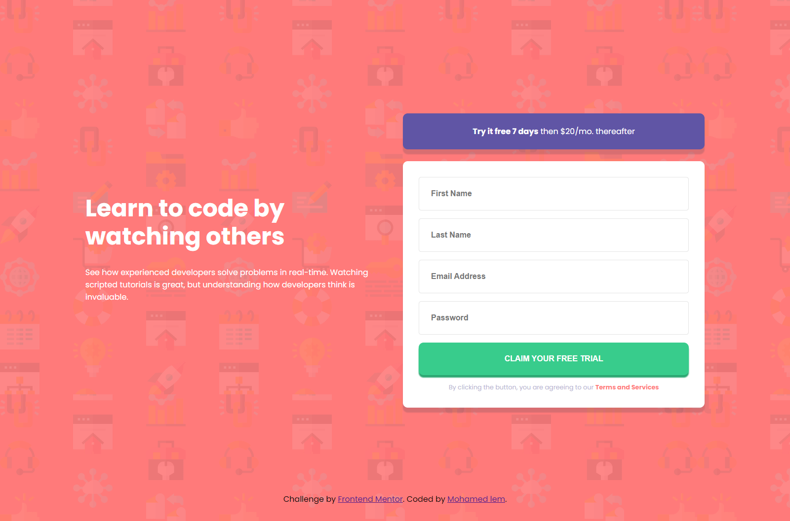

## Table of contents

- [Screenshot](#screenshot)
- [My process](#my-process)
- [Built with](#built-with)
- [What I learned](#what-i-learned)
- [Author](#author)

### Screenshot

### Links

- Solution URL: [Add solution URL here](https://your-solution-url.com)
- Live Site URL: [Add live site URL here](https://your-live-site-url.com)

## My process

I started with html planning which elements to use then styled the page with CSS(SASS) and finaly JavaScript

### Built with

- Semantic HTML5 markup
- SASS
- Flexbox
- Mobile-first workflow
- Pure JavaScript

### What I learned

- I learned that going with the mobile first aproach is ideal as the elemens are by default layed correctly and there is no need to use flex or grid
- this made me realise that setting the html/body height to 100% all the time is not ideal to every situation and mess up the layout sometimes

## Author

- Frontend Mentor - [@Mohamed lem](https://www.frontendmentor.io/profile/MedtheVorg)
